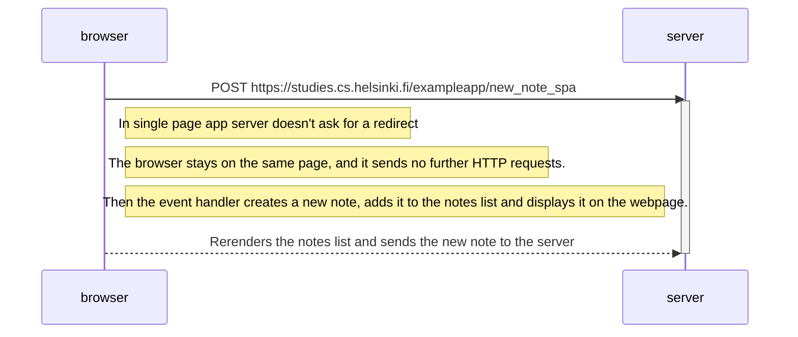

```mermaid
sequenceDiagram
    participant browser
    participant server

  
    browser->>server: POST https://studies.cs.helsinki.fi/exampleapp/new_note_spa
    activate server
    Note right of browser: In single page app server doesn't ask for a redirect
        Note right of browser: The browser stays on the same page, and it sends no further HTTP requests.
        Note right of browser: Then the event handler creates a new note, adds it to the notes list and displays it on the webpage.
    browser-->>server: Rerenders the notes list and sends the new note to the server
    deactivate server
```
